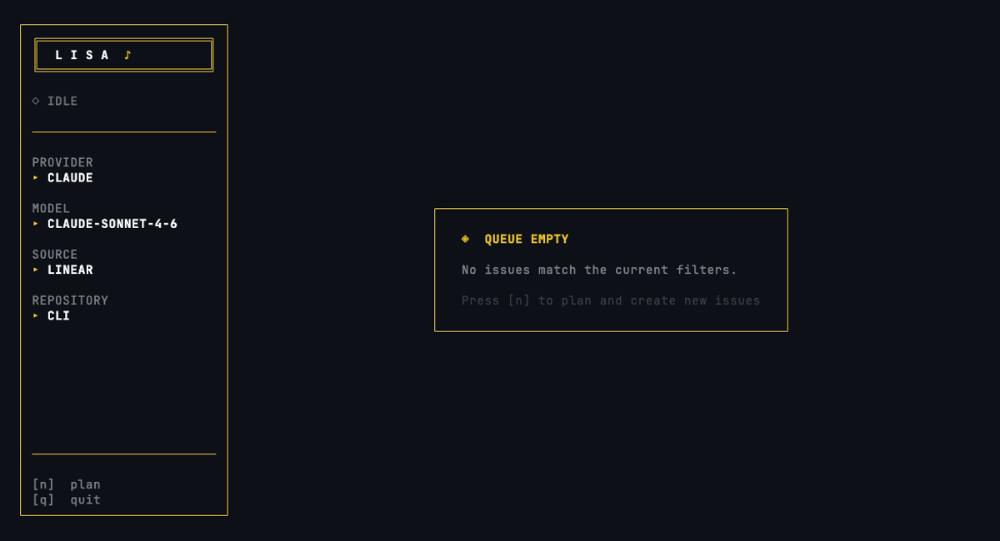

# Lisa

<p align="center">
  
</p>

<p align="center">
  <strong>Label an issue. Walk away. Come back to a PR.</strong>
</p>

<p align="center">
  
</p>

<p align="center">
  Lisa is an autonomous issue resolver that turns your backlog into pull requests — no babysitting required.
</p>

<p align="center">
  <a href="https://www.npmjs.com/package/@tarcisiopgs/lisa"></a>
  <a href="https://www.npmjs.com/package/@tarcisiopgs/lisa"></a>
  <a href="LICENSE"></a>
  
</p>

---

## Quickstart

```bash
npm install -g @tarcisiopgs/lisa
lisa init
lisa run
```

That's it. Lisa picks up the next labeled issue, implements it, pushes a branch, opens a pull request, and moves the ticket to "In Review" — all without you touching it.

`lisa init` offers pre-defined templates for the most common source + provider combinations (GitHub Issues + Claude, Linear + Claude, Jira + Claude, and more). Select a template to pre-fill sensible defaults, or choose "Configure manually" for full control.

## Try it safely first

Before letting Lisa touch real issues, verify your configuration with `--dry-run`. No issues will be fetched, no code will be written, no PRs will be created.

```bash
lisa run --once --dry-run
```

Example output:

```
[dry-run] Would fetch issue from linear (Engineering/Web App)
[dry-run] Workflow mode: worktree
[dry-run] Models priority: claude/claude-sonnet-4-6
[dry-run] Then implement, push, create PR, and update issue status
```

If the output looks correct, you're ready to run Lisa for real.

## What Lisa Does

Lisa follows a deterministic pipeline:

```
┌─────────┐    ┌──────────┐    ┌───────────┐    ┌──────────┐    ┌────┐    ┌────────┐
│  Fetch   │───▶│ Activate │───▶│ Implement │───▶│ Validate │───▶│ PR │───▶│ Update │
└─────────┘    └──────────┘    └───────────┘    └──────────┘    └────┘    └────────┘
```

1. **Fetch** — Pulls the next issue from your project tracker matching the configured label, team, and project. Issues are sorted by priority. Blocked issues are skipped.
2. **Activate** — Moves the issue to `in_progress` so your team knows it's being worked on.
3. **Implement** — Builds a structured prompt with full issue context and sends it to the AI agent. The agent works in a worktree or branch, implements the change, runs tests, and commits.
4. **Validate** — If the agent's tests pass and pre-push hooks succeed, the branch is pushed. If hooks fail, Lisa re-invokes the agent with the error output and retries.
5. **PR** — Pushes the branch and creates a pull request (or merge request) referencing the original issue.
6. **Update** — Moves the issue to the `done` status and removes the pickup label.
7. **Next** — Picks the next issue. When there are no more matching issues, Lisa stops.

### What makes it different

- **Deterministic, not hopeful** — Each issue follows a structured pipeline with clear stages. No blind retries, no speculative loops.
- **Token efficiency** — Each issue gets one focused prompt. No wasted retries, no idle polling.
- **Multi-repo awareness** — Plans across multiple repos, executes in the correct order, creates one PR per repo.
- **Model fallback** — Configure a chain of models. Transient errors (429, quota, timeout) trigger the next model automatically.
- **Workflow integration** — Issues move through your board in real time. Your team always knows what's being worked on.
- **Self-healing** — Orphan issues stuck in "In Progress" are recovered on startup. Pre-push failures trigger the agent to fix and retry.
- **Guardrails** — Past failures are logged and injected into future prompts so the agent avoids repeating mistakes.

---

## Issue Sources

Lisa integrates with **7 project trackers** out of the box:

| Source | Key | Notes |
|--------|-----|-------|
| Linear | `linear` | GraphQL API — priority-sorted, project-scoped, blocker-aware |
| GitHub Issues | `github-issues` | Native GitHub issues with label-based pickup |
| Jira | `jira` | Atlassian Jira via REST API (cloud and self-hosted) |
| GitLab Issues | `gitlab-issues` | GitLab issues with label transitions |
| Trello | `trello` | Card-based workflow via Trello REST API |
| Plane | `plane` | Open-source project management (cloud and self-hosted) |
| Shortcut | `shortcut` | Story-based tracking (formerly Clubhouse) |

Each source supports label filtering, priority ordering, and status transitions out of the box. See [Source-Specific Fields](#source-specific-fields) for configuration details.

---

## AI Providers

Lisa supports **8 AI coding agents** as implementation backends:

| Provider | Key | Command |
|----------|-----|---------|
| Claude Code | `claude` | `claude` |
| Gemini CLI | `gemini` | `gemini` |
| OpenCode | `opencode` | `opencode` |
| GitHub Copilot CLI | `copilot` | `copilot` |
| Cursor Agent | `cursor` | `agent` / `cursor-agent` |
| Goose | `goose` | `goose` |
| Aider | `aider` | `aider` |
| OpenAI Codex | `codex` | `codex` |

At least one provider must be installed and available in your PATH.

> **Cursor Free plan** — `lisa init` automatically detects Free accounts and restricts model selection to `auto` only. On paid plans, available models are fetched live from `cursor --list-models` and filtered to a curated top-tier list (`composer-1.5`, `opus-4.6`, `sonnet-4.6`, `gpt-5.3-codex`, etc.).

> **OpenCode** — `lisa init` fetches available models from `opencode models` and filters them based on which API keys are present in your environment (`ANTHROPIC_API_KEY`, `GEMINI_API_KEY`, `OPENAI_API_KEY`, `GITHUB_TOKEN`, `GROQ_API_KEY`, `MISTRAL_API_KEY`, `DEEPSEEK_API_KEY`). Only models from providers you have credentials for are shown.

### Fallback Chain

Configure multiple models — Lisa tries each in order. Transient errors (429, quota, timeout, network) trigger the next model; non-transient errors stop the chain.

```yaml
provider: claude
models:
  - claude-sonnet-4-6   # primary
  - claude-opus-4-6     # fallback 1
  - claude-haiku-4-5    # fallback 2
```

---

## PR Delivery

Lisa delivers pull requests and merge requests to **4 platforms**:

| Platform | Key | Auth | Output |
|----------|-----|------|--------|
| GitHub CLI | `cli` | `gh auth login` | Pull Request |
| GitHub API | `token` | `GITHUB_TOKEN` | Pull Request |
| GitLab | `gitlab` | `GITLAB_TOKEN` | Merge Request |
| Bitbucket | `bitbucket` | `BITBUCKET_TOKEN` + `BITBUCKET_USERNAME` | Pull Request |

Set `platform` in your config (or pass `--platform` at runtime) to select the delivery method:

```yaml
platform: gitlab   # or: cli, token, bitbucket
```

```bash
lisa run --platform bitbucket   # override at runtime
```

Each platform appends a `🤖 Resolved by lisa` attribution comment to the PR/MR after creation.

---

## Install

```bash
npm install -g @tarcisiopgs/lisa
```

## Environment Variables

```bash
# PR/MR delivery — set one based on your platform
export GITHUB_TOKEN=""       # GitHub — or have `gh` CLI authenticated (platform: cli or token)
export GITLAB_TOKEN=""       # GitLab MR creation (platform: gitlab)
export BITBUCKET_TOKEN=""    # Bitbucket PR creation (platform: bitbucket)
export BITBUCKET_USERNAME="" # Bitbucket username (required with BITBUCKET_TOKEN)

# Required when source = linear
export LINEAR_API_KEY=""

# Required when source = trello
export TRELLO_API_KEY=""
export TRELLO_TOKEN=""

# Required when source = plane
export PLANE_API_TOKEN=""
export PLANE_BASE_URL=""  # optional; defaults to https://api.plane.so
export PLANE_WORKSPACE="" # optional; fallback when team is not set in config

# Required when source = shortcut
export SHORTCUT_API_TOKEN=""

# Required when source = gitlab-issues or github = gitlab
export GITLAB_TOKEN=""
export GITLAB_BASE_URL=""  # optional; defaults to https://gitlab.com

# Required when source = github-issues
export GITHUB_TOKEN=""     # same token used for PR creation

# Required when source = jira
export JIRA_BASE_URL=""        # e.g. https://yourcompany.atlassian.net
export JIRA_EMAIL=""           # Atlassian account email
export JIRA_API_TOKEN=""       # Atlassian API token

# Optional — anonymous crash reporting (disabled by default)
export LISA_TELEMETRY=1        # enable anonymous crash/error reporting
export LISA_NO_TELEMETRY=1     # disable reporting (overrides LISA_TELEMETRY and config)
```

## Commands

| Command | Description |
|---------|-------------|
| `lisa run` | Run the agent loop |
| `lisa run --once` | Process a single issue |
| `lisa run --once --dry-run` | **Recommended first step** — preview config without executing |
| `lisa run --watch` / `-w` | Keep running after queue empties — poll every 60s for new issues |
| `lisa run --issue ID` | Process a specific issue by identifier or URL |
| `lisa run --limit N` | Process up to N issues |
| `lisa run --concurrency N` / `-c N` | Process up to N issues in parallel (default: 1) |
| `lisa run --dry-run` | Preview without executing |
| `lisa run --provider NAME` | Override AI provider |
| `lisa run --source NAME` | Override issue source |
| `lisa run --label NAME` | Override label filter |
| `lisa run --platform METHOD` | Override PR platform (`cli`, `token`, `gitlab`, or `bitbucket`) |
| `lisa run --no-bell` | Disable terminal bell on issue completion/failure |
| `lisa init` | Create `.lisa/config.yaml` interactively (offers pre-defined templates) |
| `lisa config` | Edit config interactively |
| `lisa config --show` | Print current config as JSON |
| `lisa config --set key=value` | Set a single config value |
| `lisa status` | Show session stats |
| `lisa issue get <id>` | Fetch full issue details as JSON (for use inside worktrees) |
| `lisa issue done <id> --pr-url <url>` | Complete issue, attach PR, update status, remove label |
| `lisa feedback --pr <url> --issue <id>` | Inject PR review comments from a closed-without-merge PR into guardrails |

## TUI

When running in an interactive terminal, `lisa run` renders a real-time Kanban board:

```
┌──────────────────────────┐ ┌───────────────────────────┐ ┌───────────────────────────┐
│ ▶ BACKLOG            [3] │ │ ▶ IN PROGRESS         [1] │ │ ▶ IN REVIEW           [2] │
│                          │ │                           │ │                           │
│ ┌────────────────────┐   │ │ ┌─────────────────────┐   │ │ ┌─────────────────────┐   │
│ │ ENG-42             │   │ │ │ ● ENG-38             │   │ │ │ ✓ ENG-35            │   │
│ │ Add dark mode      │   │ │ │ Fix login redirect   │   │ │ │ Update dependencies │   │
│ │ ready              │   │ │ │ ~1 running           │   │ │ │ PR created          │   │
│ └────────────────────┘   │ │ └─────────────────────┘   │ │ └─────────────────────┘   │
└──────────────────────────┘ └───────────────────────────┘ └───────────────────────────┘
```

In-progress cards show a live elapsed timer and the last action taken by the provider. A global progress bar in the header tracks overall session progress. When the loop is paused, active cards display a visual pause indicator. The detail view includes a scroll bar when output overflows and shows the active model name in the sidebar.

### Keyboard shortcuts

| Key | Action |
|-----|--------|
| `←` / `→` | Move between columns |
| `Tab` / `Shift+Tab` | Move between columns (alternative) |
| `↑` / `↓` | Navigate cards / scroll output |
| `Enter` | Open issue detail view (streams provider output) |
| `o` | Open PR in browser (when viewing a completed card with a PR) |
| `Esc` | Close detail view, return to board |
| `k` | Kill the selected in-progress issue |
| `s` | Skip the selected in-progress issue |
| `p` | Pause / resume all active providers |
| `q` | Quit |

The sidebar legend updates contextually: board shortcuts when browsing the Kanban, scroll and back hints when viewing issue detail. The terminal tab title also updates in real time: it shows a spinner with the active issue ID while work is in progress, and a checkmark when done.

## Configuration

Config lives in `.lisa/config.yaml`. Run `lisa init` to create it interactively.

```yaml
provider: claude
source: linear
workflow: worktree

source_config:
  team: Engineering
  project: Web App
  label: ready
  pick_from: Backlog
  in_progress: In Progress
  done: In Review

platform: cli        # "cli" (gh), "token" (GITHUB_TOKEN), "gitlab" (GITLAB_TOKEN), or "bitbucket" (BITBUCKET_TOKEN)
workspace: .
base_branch: main

repos:
  - name: my-api
    path: ./api
    base_branch: main
    match: "[API]"        # route issues whose title starts with "[API]" to this repo
  - name: my-app
    path: ./app
    base_branch: main

loop:
  cooldown: 10       # seconds between issues
  max_sessions: 0    # 0 = unlimited
  concurrency: 1     # issues processed in parallel (default: 1; >1 forces worktree mode)

logs:
  dir: .lisa/logs

# Optional — kill stuck providers
overseer:
  enabled: true
  check_interval: 30     # seconds between git status checks
  stuck_threshold: 300   # seconds without git changes before killing

# Optional — validate issue spec before accepting
validation:
  require_acceptance_criteria: true  # skip issues without detectable acceptance criteria (default: true)

# Optional — anonymous crash/error reporting (disabled by default)
telemetry:
  enabled: true  # set via `lisa init` prompt or LISA_TELEMETRY=1; override with LISA_NO_TELEMETRY=1
```

### Source-Specific Fields

| Field | Linear | Trello | Plane | Shortcut | GitLab Issues | GitHub Issues | Jira |
|-------|--------|--------|-------|----------|---------------|---------------|------|
| `team` | Team name | Board name | Workspace slug | Group name (optional) | Project path (`namespace/project`) or numeric ID | `owner/repo` | Project key (e.g. `ENG`) |
| `project` | Project name | — | Project identifier or UUID | — | — | — | — |
| `pick_from` | Status to pick issues from | List to pick cards from | State name to pick issues from | Workflow state to pick stories from | — | — | Status to pick issues from |
| `label` | Label to filter issues | Label to filter cards | Label to filter issues | Label to filter stories | Label to filter issues | Label to filter issues | Label to filter issues |
| `remove_label` | Label removed after pickup (optional; defaults to `label`) | Same | Same | Same | Same | Same | Same |
| `in_progress` | In-progress status | In-progress column | In-progress state name | In-progress workflow state | Label to apply on activate | Label to apply on activate | In-progress status name |
| `done` | Destination status after PR | Destination column after PR | Done state name | Done workflow state | Closes the issue | Closes the issue | Destination status after PR |

`label` can also be a list — Lisa picks any issue that has **all** of the specified labels. `remove_label` controls which label is removed after pickup, useful when you want to keep some labels intact. Example:

```yaml
source_config:
  label: [ready, api]   # pick issues labelled both "ready" and "api"
  remove_label: ready   # only remove "ready" after pickup; "api" is preserved
```

Plane example:

```yaml
source: plane
source_config:
  team: my-workspace       # workspace slug (or set PLANE_WORKSPACE env var)
  project: DEV             # project identifier or UUID
  label: ready             # issues with this label are picked up
  pick_from: Todo          # state to fetch issues from
  in_progress: In Progress # state set when Lisa starts working
  done: Done               # state set after PR is created
```

Shortcut example:

```yaml
source: shortcut
source_config:
  label: ready              # stories with this label are picked up
  pick_from: Ready for Development  # workflow state to fetch stories from
  in_progress: In Progress  # state set when Lisa starts working
  done: Done                # state set after PR is created
```

GitLab Issues example:

```yaml
source: gitlab-issues
source_config:
  team: my-org/my-repo     # namespace/project path or numeric project ID
  label: ready              # issues with this label are picked up
  in_progress: in-progress  # label applied when Lisa starts working
  done: ""                  # issue is closed after PR (value unused)
```

GitHub Issues example:

```yaml
source: github-issues
source_config:
  team: my-org/my-repo     # owner/repo
  label: ready              # issues with this label are picked up
  in_progress: in-progress  # label applied when Lisa starts working
  done: ""                  # issue is closed after PR (value unused)
```

Jira example:

```yaml
source: jira
source_config:
  team: ENG                # Jira project key
  label: lisa              # label to filter issues
  pick_from: Backlog       # status to pick issues from
  in_progress: In Progress # status applied when Lisa starts working
  done: In Review          # status applied after PR is created
```

### Workflow Modes

**Branch** — The AI agent creates a branch directly in your current checkout, implements the changes, and pushes. Simple setup, works everywhere.

**Worktree** — Lisa creates an isolated [git worktree](https://git-scm.com/docs/git-worktree) for each issue under `.worktrees/`. The agent works in the worktree without touching your main checkout. After the PR is created, the worktree is cleaned up automatically. Ideal when you want to keep working in the repo while Lisa resolves issues in the background.

**Multi-repo worktree** — When multiple repos are configured, Lisa runs a two-phase flow: a planning agent produces a `.lisa-plan.json` with ordered steps, then Lisa executes each step sequentially — one worktree and one PR per repo. Cross-repo context (branch names, PR URLs) is passed to each subsequent step.

### Concurrent Execution

Process multiple issues in parallel with `--concurrency`:

```bash
lisa run --concurrency 3   # or -c 3
```

Each issue runs in its own isolated worktree with an independent provider process. When `--concurrency` is greater than 1, worktree mode is enforced automatically. The default is 1 (sequential, backward-compatible).

- **Isolation** — Each issue gets its own worktree, log file, and manifest. No shared state between concurrent sessions.
- **Shared infrastructure** — Docker containers and lifecycle resources are started once and shared across worktrees.
- **Guardrails** — Writes to the guardrails file are serialized to prevent concurrent corruption.
- **TUI** — Multiple cards appear in the In Progress column simultaneously. `[k]` and `[s]` target the selected card; `[p]` pauses all active providers.
- **Fallback** — Each issue has its own independent fallback chain.
- **Slot filling** — When an issue completes, the freed slot is immediately filled with the next available issue.

### PR Stacking

When an issue depends on another issue that is still in progress, Lisa passes the dependency context to the agent automatically. The agent receives the parent issue ID, the branch name, the open PR URL, and the list of changed files — so it can build on top of the parent branch cleanly rather than branching from `main`.

Lisa detects blocked issues using the `completedBlockerIds` from your issue tracker (Linear blockers, GitHub milestone links, etc.) and skips issues whose blockers are not yet completed. Once a blocker is resolved, the dependent issue becomes eligible and will be picked up in a future loop.

### Recovery Mechanisms

- **Orphan recovery** — On startup, Lisa scans for issues stuck in `in_progress` from interrupted runs and reverts them to `pick_from`.
- **Push recovery** — If `git push` fails due to pre-push hooks (linter, typecheck, tests), Lisa re-invokes the agent with the error output and retries the push.
- **Signal handling** — SIGINT/SIGTERM gracefully revert the active issue to its previous status before exiting.
- **Guardrails** — Failed sessions and rejected PR reviews are logged and injected into future prompts so the agent avoids repeating the same mistakes.
- **PR feedback injection** — When a PR created by Lisa is closed without merge, review comments are automatically captured and injected as guardrails for the next run of the same issue. Use `lisa feedback --pr <url> --issue <id>` to inject feedback manually.

### Overseer

When enabled, the overseer periodically checks `git status` in the working directory. If no changes are detected within `stuck_threshold` seconds, the provider process is killed and the error is eligible for fallback to the next model.

### Issue Spec Validation

Before starting work on an issue, Lisa validates that it has a minimum spec. Issues that fail validation are skipped, labelled `needs-spec`, and have their `ready` label removed — so they never block the queue.

An issue passes validation if its description is non-empty and contains at least one of:

- A Markdown checklist item (`- [ ]`)
- The phrase `acceptance criteria` or `critérios`
- The words `expected`, `should`, or `deve`

To disable spec validation (e.g. for quick one-off issues):

```yaml
validation:
  require_acceptance_criteria: false
```

> **Note:** For Linear, Lisa auto-creates the `needs-spec` label if it does not exist. For other trackers, the label must exist before Lisa can apply it — Lisa will log a warning if it is missing.

### Infrastructure Auto-Discovery

Lisa auto-discovers Docker Compose services in each repository and starts them before handing control to the agent. If a `docker-compose.yml` / `compose.yml` is present, Lisa reads port mappings and starts the services, waiting for each port to become ready.

**Dynamic port allocation** prevents collisions when multiple Lisa instances run in parallel. Add `port_range` and `port_env_var` to any discovered or manually configured resource:

```yaml
repos:
  - path: api
    # lifecycle config is resolved by auto-discovery (docker-compose.yml)
    # port_range and port_env_var can be set via manual config override
```

When `port_range` is set, Lisa scans ports `check_port` through `check_port + port_range - 1` and picks the first free one. The chosen port is injected into the resource process via `port_env_var` and is available to `setup` commands and the agent environment.

| Field | Type | Description |
|---|---|---|
| `check_port` | `number` | Preferred (base) port |
| `port_range` | `number` (optional) | How many ports to scan from `check_port` |
| `port_env_var` | `string` (optional) | Env var name to inject the allocated port (e.g. `DATABASE_PORT`) |

If no free port is found within the range, Lisa logs a clear error and aborts the session.

### Auto-Detection

Lisa auto-detects `vitest` or `jest` from `package.json` dependencies and injects the correct test command into the agent prompt. It also detects the package manager from lockfiles (`bun.lockb`/`bun.lock` → `bun`, `pnpm-lock.yaml` → `pnpm`, `yarn.lock` → `yarn`, otherwise `npm`).

## License

[MIT](LICENSE)
