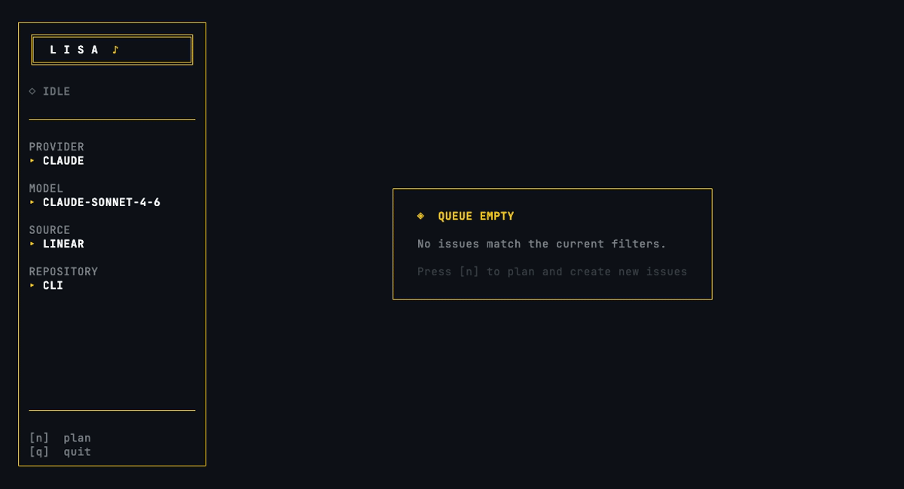

# Lisa

<p align="center">
  <strong>Plan issues. Run agents. Get PRs.</strong>
</p>

<p align="center">
  <a href="https://www.npmjs.com/package/@tarcisiopgs/lisa"></a>
  <a href="https://www.npmjs.com/package/@tarcisiopgs/lisa"></a>
  <a href="LICENSE"></a>
  
</p>

<p align="center">
  
</p>

Lisa connects your issue tracker to an AI coding agent and delivers pull requests — autonomously. Describe a goal, Lisa decomposes it into issues, picks them up, implements each one, opens PRs, and updates your board. No babysitting.

## Quickstart

```bash
npm install -g @tarcisiopgs/lisa
lisa init    # interactive setup wizard
lisa         # start the agent loop
```

## How It Works

```
  Plan → Create issues → Fetch → Implement → Push → Open PR → Update board → Next
```

Lisa starts and shows a Kanban board. If the queue is empty, press `n` to plan — describe a goal and the AI brainstorms with you (asking clarifying questions), presents its understanding for your confirmation, then decomposes the goal into atomic issues created directly in your tracker. You can review, edit, reorder, delete, or regenerate the plan with feedback before approving. Press `r` to start processing. Lisa picks the highest-priority labeled issue, moves it to "In Progress", sends a structured prompt to the AI agent, and monitors execution. The agent works in an isolated git worktree, implements the change, runs tests, and commits. Lisa pushes, opens a PR, moves the ticket to "In Review", and picks up the next one.

If something fails — pre-push hooks, quota limits, stuck processes — Lisa handles it: retries with error context, falls back to the next model, or kills and moves on.

## Features

- **7 issue trackers** — Linear, GitHub Issues, GitLab Issues, Jira, Trello, Plane, Shortcut
- **8 AI agents** — Claude Code, Gemini CLI, GitHub Copilot CLI, Cursor Agent, Aider, Goose, OpenCode, Codex
- **AI planning** — describe a goal, the AI brainstorms with you, decomposes it into issues with dependencies, created in your tracker
- **Language-aware** — detects your goal's language (pt/en/es) and generates issues in the same language
- **Concurrent execution** — process multiple issues in parallel, each in its own worktree
- **Multi-repo** — plans across repos, creates one PR per repo in the correct order
- **Model fallback** — chain models; transient errors (429, quota, timeout) auto-switch to the next
- **Real-time TUI** — Kanban board with live provider output, plan mode, merge PRs with `m`
- **CI monitoring** — polls CI after PR creation, re-invokes the agent to fix failures automatically
- **Progress comments** — posts real-time status updates on issues as Lisa works through stages
- **Context enrichment** — greps for issue-related files and surfaces them in the agent prompt
- **Self-healing** — orphan recovery on startup, push failure retry, stuck process detection
- **Guardrails** — past failures are injected into future prompts to avoid repeating mistakes
- **Project context** — auto-generates `.lisa/context.md` with your stack, conventions, and constraints

## Providers

| Provider | Key | Provider | Key |
|----------|-----|----------|-----|
| Claude Code | `claude` | Cursor Agent | `cursor` |
| Gemini CLI | `gemini` | Goose | `goose` |
| GitHub Copilot CLI | `copilot` | Aider | `aider` |
| OpenCode | `opencode` | OpenAI Codex | `codex` |

Configure models and provider-specific options:

```yaml
provider: claude
provider_options:
  claude:
    models:
      - claude-sonnet-4-6   # primary
      - claude-opus-4-6     # fallback
    effort: high             # optional: low, medium, high, max
```

Goose requires a backend selection:

```yaml
provider: goose
provider_options:
  goose:
    goose_provider: gemini-cli   # gemini-cli, anthropic, openai, google, ollama
    models:
      - gemini-2.5-pro
```

## Commands

```bash
lisa                        # start the agent loop (Kanban TUI)
lisa --once                 # process a single issue
lisa --once --dry-run       # preview config without executing
lisa --watch                # poll for new issues after queue empties
lisa -c 3                   # process 3 issues in parallel
lisa --issue INT-42         # process a specific issue
lisa --limit 5              # stop after 5 issues
lisa plan "Add rate limiting" # brainstorm + decompose goal into issues via AI
lisa plan --issue EPIC-123  # decompose existing issue into sub-issues
lisa plan --continue        # resume interrupted plan
lisa plan --no-brainstorm "goal" # skip brainstorming, decompose directly
lisa plan --yes "goal"      # skip confirmations (CI/scripts)
lisa init                   # create .lisa/config.yaml interactively
lisa status                 # show session stats
lisa doctor                 # diagnose setup issues (config, provider, env, git)
lisa context refresh        # regenerate project context
lisa feedback --pr URL      # inject PR review feedback into guardrails
```

Append `--json` to any command for machine-readable output. Use `--verbose` / `--quiet` to control log verbosity.

## Configuration

Config lives in `.lisa/config.yaml`. Run `lisa init` to create it interactively.

```yaml
provider: claude
source: linear
workflow: worktree       # "worktree" (isolated) or "branch" (in-place)

source_config:
  scope: Engineering
  project: Web App
  label: ready              # or array: [ready, urgent]
  remove_label: ready       # label to remove on completion (defaults to label)
  pick_from: Backlog
  in_progress: In Progress
  done: In Review

bell: true                  # terminal bell on issue completion

platform: cli            # "cli" (gh), "token" (GITHUB_TOKEN), "gitlab", "bitbucket"
base_branch: main
```

<details>
<summary><strong>Environment variables</strong></summary>

```bash
# PR creation (at least one)
GITHUB_TOKEN=""           # or use `gh` CLI
GITLAB_TOKEN=""           # for platform: gitlab
BITBUCKET_TOKEN=""        # for platform: bitbucket
BITBUCKET_USERNAME=""

# Issue tracker (set the one you use)
LINEAR_API_KEY=""
TRELLO_API_KEY="" && TRELLO_TOKEN=""
PLANE_API_TOKEN=""
SHORTCUT_API_TOKEN=""
GITLAB_TOKEN=""
GITHUB_TOKEN=""
JIRA_BASE_URL="" && JIRA_EMAIL="" && JIRA_API_TOKEN=""

# Self-hosted instances (optional)
PLANE_BASE_URL=""         # default: https://api.plane.so
GITLAB_BASE_URL=""        # default: https://gitlab.com
PLANE_WORKSPACE=""        # fallback for source_config.scope

# Goose backend (required when provider: goose)
GOOSE_PROVIDER=""         # gemini-cli, anthropic, openai, google, ollama
GOOSE_MODEL=""            # model name for the selected backend

# AI provider API keys (used by Aider / Goose / wizard auto-detection)
ANTHROPIC_API_KEY=""
OPENAI_API_KEY=""
GEMINI_API_KEY=""
GOOGLE_API_KEY=""         # for Goose with goose_provider: google
```

</details>

<details>
<summary><strong>Source-specific configuration</strong></summary>

| Field | Linear | Trello | Plane | Shortcut | GitLab Issues | GitHub Issues | Jira |
|-------|--------|--------|-------|----------|---------------|---------------|------|
| `scope` | Team name | Board name | Workspace slug | — | Project path | `owner/repo` | Project key |
| `project` | Project name | — | Project ID | — | — | — | — |
| `pick_from` | Status name | List name | State name | Workflow state | — | — | Status name |
| `label` | Label | Label | Label | Label | Label | Label | Label |
| `remove_label` | Label | Label | Label | Label | — | — | — |
| `in_progress` | Status | Column | State | Workflow state | Label | Label | Status |
| `done` | Status | Column | State | Workflow state | Closes issue | Closes issue | Status |

</details>

<details>
<summary><strong>Multi-repo setup</strong></summary>

```yaml
repos:
  - name: my-api
    path: ./api
    base_branch: main
    match: "[API]"        # route issues by title prefix
  - name: my-app
    path: ./app
    base_branch: main
```

Lisa runs a planning phase, then executes steps sequentially — one worktree and one PR per repo.

</details>

<details>
<summary><strong>Advanced options</strong></summary>

```yaml
loop:
  cooldown: 10             # seconds between issues
  session_timeout: 0       # max seconds per provider run (0 = disabled)
  output_stall_timeout: 120  # seconds without stdout before killing provider (0 = disabled)

overseer:
  enabled: true
  check_interval: 30       # seconds between git status checks
  stuck_threshold: 300     # kill provider after this many seconds without changes

lifecycle:
  mode: auto               # "auto", "skip" (default), "validate-only"
  timeout: 30

proof_of_work:
  enabled: true
  block_on_failure: true   # skip PR when validation fails (default: false)
  max_retries: 2           # retry agent on validation failure
  commands:
    - name: lint
      run: pnpm run lint
    - name: typecheck
      run: pnpm run typecheck
    - name: test
      run: pnpm run test

validation:
  require_acceptance_criteria: true

ci_monitor:
  enabled: true
  max_retries: 3             # fix attempts on CI failure
  poll_interval: 30          # seconds between CI status checks
  poll_timeout: 600          # max seconds to wait for CI
  block_on_failure: false    # revert issue if CI never passes

progress_comments:
  enabled: true              # post real-time status on issues
```

</details>

## Writing Good Issues

Issue quality = PR quality. Lisa validates issues and skips vague ones (labeling them `needs-spec`).

**Include:** acceptance criteria (`- [ ]` checklists), relevant file paths, technical constraints, stack info.

```markdown
Title: Add rate limiting to /api/users endpoint

Implement rate limiting on `/api/users` to prevent abuse.

Relevant files: src/routes/users.ts, src/middleware/auth.ts

Acceptance criteria:
- [ ] Requests exceeding 100/min per IP return HTTP 429
- [ ] Rate limit headers included in responses
- [ ] Rate limit state stored in Redis (use src/lib/redis.ts)
- [ ] Existing tests still pass
```

## TUI

The real-time Kanban board shows issue progress, streams provider output, and detects PR merges. When the queue is empty, Lisa enters idle mode — plan new issues with `n`, then start processing with `r`.

**Board view**

| Key | Action | Key | Action |
|-----|--------|-----|--------|
| `←` `→` | Switch columns | `k` | Kill current issue |
| `↑` `↓` | Navigate cards | `n` | Open plan mode |
| `↵` | Open detail view | `r` | Run (from idle) |
| `p` | Pause / resume | `q` | Quit |

**Detail view**

| Key | Action |
|-----|--------|
| `↑` `↓` | Scroll output log |
| `o` | Open PR in browser |
| `m` | Merge PR (warns if CI not passed) |
| `Esc` | Back to board |

**Plan mode**

| Key | Action |
|-----|--------|
| `↵` | Send message / view detail |
| `e` | Edit issue in $EDITOR |
| `d` | Delete issue |
| `a` | Approve and create issues |
| `Esc` | Cancel / back |

In CLI mode, the plan wizard also offers **Regenerate with feedback** — describe what to change and the AI regenerates the entire plan incorporating your feedback.

## License

[MIT](LICENSE)
